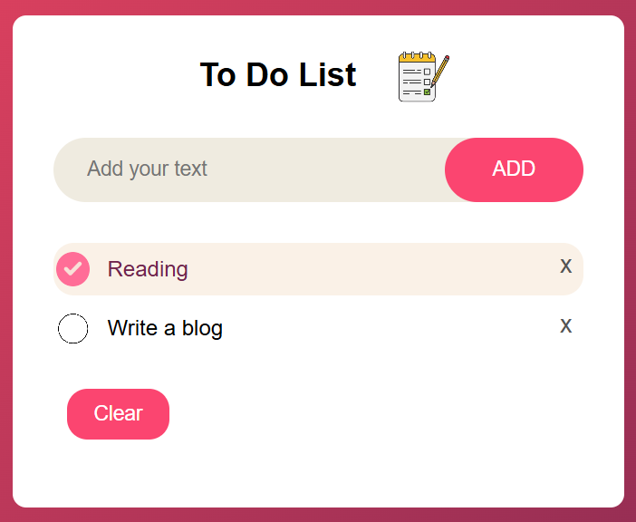

# 📝 To-Do List App

## 🌟 Project Description
This is a simple and interactive To-Do List App designed to help users manage their daily tasks. It allows users to add tasks, mark them as completed, delete individual tasks, and clear all tasks at once. Additionally, completed tasks are visually highlighted for better distinction.

---

## 🚀 Features

1. **➕ Add Tasks**
   - Users can add tasks one by one to the list.

2. **✔️ Mark Tasks as Completed**
   - A check icon appears for completed tasks.
   - Background and text color change when a task is marked as completed.

3. **❌ Remove Individual Tasks**
   - A cross sign allows users to delete a specific task.

4. **🗑️ Clear All Tasks**
   - A single button removes all tasks from the list.

5. **🎨 Dynamic Styling**
   - Completed tasks are visually distinguished with a change in background and text color.

---

## 🛠️ Technologies Used

- **HTML**: For structuring the content.
- **CSS**: For custom styling.
- **JavaScript**: For functionality, using arrow functions and DOM manipulation.
- **Local Storage**: To save tasks and ensure they persist even after refreshing the page.

---

## 📸 Screenshots

